% Penguins 데이터 분석 슬라이드
% 작성자: icb_slide 자동생성
% 날짜: 2025-12-23

# Penguins 데이터 분석

본 발표 자료는 Palmer/Seaborn 펭귄 데이터셋을 기반으로 10개 이상의 시각화와 교차표/피봇테이블을 포함하여 주요 통찰을 정리한 20페이지 분량의 슬라이드입니다.

---

# 목차

1. 개요 및 데이터 요약
2. 히스토그램(부리 길이, 부리 깊이, 플리퍼 길이, 체질량, 부리비)
3. 박스/바이올린(종별 분포)
4. 산점도/회귀/조인트플롯
5. 페어플롯 및 상관 히트맵
6. 범주형 막대그래프 및 교차표
7. 피봇테이블(섬 × 종 별 평균 체질량)
8. 결론 및 제언

---

# 개요 및 데이터 요약

- 데이터: Seaborn의 `penguins` (palmerpenguins와 동일 포맷)
- 샘플 수: 344건, 결측 처리 후 분석용 샘플: 333건
- 주요 변수: species, island, bill_length_mm, bill_depth_mm, flipper_length_mm, body_mass_g, sex, bill_ratio(파생)

---

# 히스토그램: bill_length_mm

**인사이트:**

펭귄의 부리 길이(bill_length_mm)는 종 간에 명확한 분포 차이를 보여, 형태학적 분류에서 중요한 특징으로 활용될 수 있습니다. 구체적으로, Gentoo 종은 전체 분포가 우측으로 치우쳐 평균값이 크고 분포의 폭이 비교적 넓어 개체 간 이질성이 큰 반면, Adelie와 Chinstrap는 대체로 짧은 부리 길이 영역에 밀집되어 있습니다. 이 패턴은 먹이 습성이나 먹이 취득 방식의 차이를 반영할 가능성이 큽니다. 예를 들어 긴 부리를 가진 개체는 특정 먹이(심해 또는 큰 먹이)를 더 효과적으로 채집할 수 있는 반면, 짧은 부리를 가진 개체는 다른 먹이 자원에 특화되어 있을 수 있습니다. 또한 히스토그램의 꼬리와 이상치를 검토하면 표본 수집 과정이나 특정 개체군의 예외적 특성을 파악할 수 있습니다. 분석적으로는 개별 변수만으로도 어느 정도 종 구분이 가능하지만, 분류 성능을 높이려면 부리 길이와 다른 형태(부리 깊이, 플리퍼 길이, 체질량 등)를 결합하는 다변량 접근이 권장됩니다.
::: notes
발표자 노트: 이 슬라이드에서는 Gentoo의 부리 길이가 다른 종에 비해 크고 분포가 넓다는 점을 강조하세요. 부리 길이가 먹이 섭취 방식과 연결될 수 있음을 간단 사례(긴 부리 -> 특정 먹이)로 설명하고, 단일 변수로 분류할 수 있으나 다른 변수와 결합하면 구분력이 더 높아진다고 언급합니다.
:::
---

# 히스토그램: bill_depth_mm

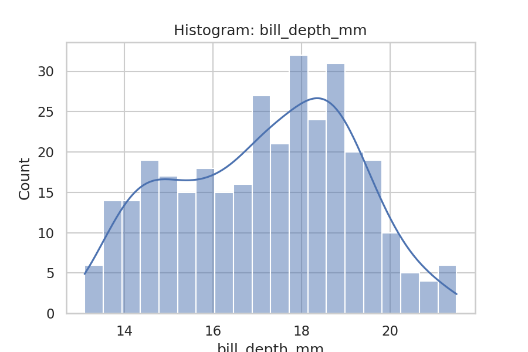

**인사이트:**

부리 깊이(bill_depth_mm)는 부리 길이와 함께 형태학적 특성을 보완하며, 종별로 평균과 분포가 다소 구분됩니다. 관측된 분포에서 Adelie와 Chinstrap는 비교적 중간-작은 깊이 범위에 밀집되어 있고, Gentoo는 다른 종과 차별화된 분포를 보일 가능성이 있습니다. 부리 깊이는 먹이의 크기나 포획 방법과 연관될 수 있어 생태적 적응을 해석할 때 중요한 단서가 됩니다. 또한 히스토그램의 분포 모양(예: 편향성, 다봉성)을 통해 해당 변수 내 하위 집단이나 성별·섬별 차이를 탐지할 수 있으며, 이상값은 개체군 내 다양성 혹은 샘플링 오류의 신호일 수 있으므로 데이터 전처리 단계에서 유심히 검토하는 것이 필요합니다. 통계적 비교(예: t-test/ANOVA)는 종 간 평균 차이를 검증하는 데 유용합니다.
::: notes
발표자 노트: 부리 깊이는 먹이 크기 및 포획 방식과 연결될 수 있음을 설명하세요. 종별 평균 차이를 확인하는 통계적 검정 방법(t-test/ANOVA)을 소개하고, 분포의 비대칭성이나 다봉성은 하위 집단 존재 가능성을 시사한다고 덧붙이세요.
:::
---

# 히스토그램: flipper_length_mm

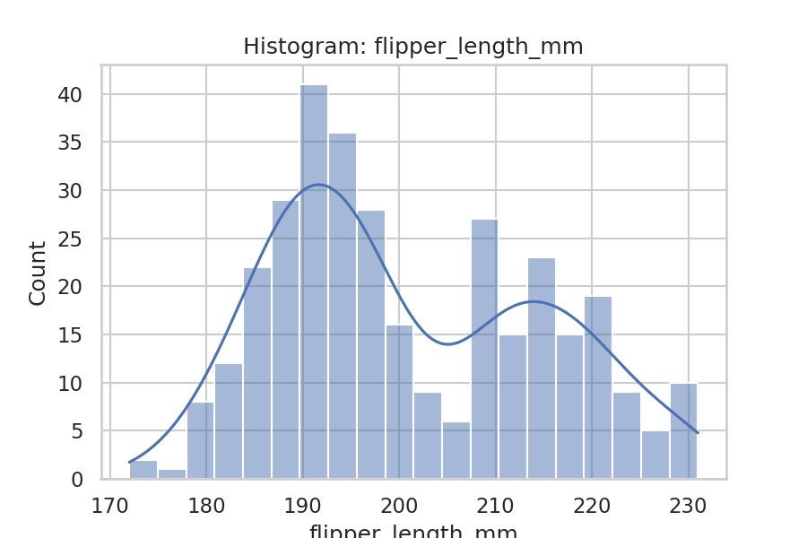

**인사이트:**

플리퍼 길이(flipper_length_mm)는 펭귄의 이동 능력·수영 성능과 밀접한 관련이 있는 물리적 지표로, 종 간 차이가 뚜렷하게 나타납니다. Gentoo 종은 전반적으로 플리퍼 길이가 길어 평균과 중앙값이 높으며, 이는 큰 체격과 높은 수영 효율을 반영할 수 있습니다. 반면 Adelie와 Chinstrap는 상대적으로 짧은 플리퍼 분포를 보여 체형의 차이에 따른 생태적·행동적 차이를 시사합니다. 플리퍼 길이는 체질량과 양의 상관을 보이는 경우가 많으므로 회귀 분석 혹은 다변량 분석에서 체질량을 예측하는 유용한 피처로 고려될 수 있습니다. 또한 성별별 비교를 통해 성적 이형성 여부를 검증하면 보다 세분화된 생물학적 해석이 가능합니다。

::: notes
발표자 노트: 플리퍼 길이 차이를 수영 성능 및 체형과 연결해 설명하세요. Gentoo의 긴 플리퍼는 더 큰 체격을 반영할 가능성이 있음을 언급하고, 성별별 분석으로 성적 이형성을 확인하는 절차를 설명합니다.
:::

---

# 히스토그램: body_mass_g

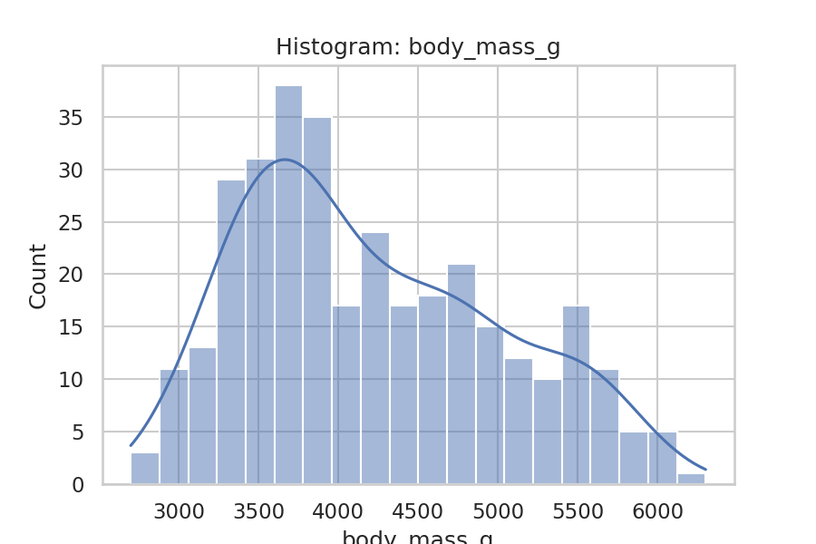

**인사이트:**

체질량(body_mass_g)은 종간 차이가 가장 분명한 변수 중 하나로, Gentoo는 높은 체질량을 보이며 Adelie와 Chinstrap는 상대적으로 낮습니다. 이러한 체질량 차이는 먹이 섭취량, 대사율, 번식 전략 및 성적 이형성과 관련될 수 있습니다. 데이터 상 겹치는 영역이 존재해도 평균 차이가 뚜렷하므로 분류 모델에 유력한 입력 변수로 쓰일 수 있습니다. 또한 체질량은 환경적 요인(예: 섬별 먹이 자원, 계절성)과 상호작용할 가능성이 높으므로 섬(island)별로 분리하여 평균과 분포를 비교하면 지역적 적응 신호를 파악하는 데 도움이 됩니다. 이상치의 존재 여부는 개체 상태(예: 임신/번식기, 영양결핍)와 연관될 수 있어 추가 조사가 권장됩니다.
::: notes
발표자 노트: 체질량 차이가 종 간 구별에 유용함을 강조하세요. Gentoo의 높은 평균을 사례로 제시하고, 섬별 환경 요인(먹이량 등)이 체질량에 미치는 영향을 언급하며 표본 불균형의 해석적 한계를 짚어줍니다.
:::
---

# 히스토그램: bill_ratio

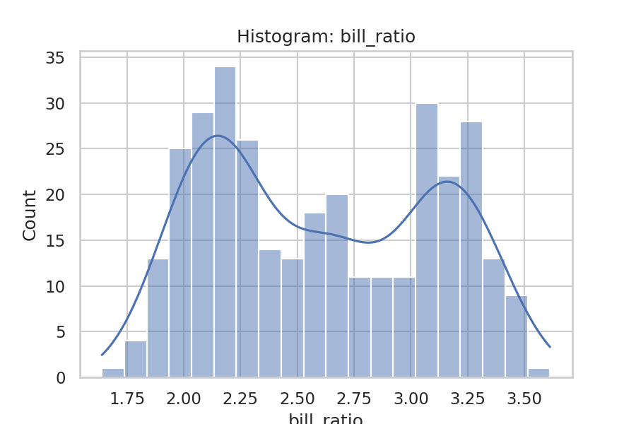

**인사이트:**

부리비(bill_ratio = bill_length_mm / bill_depth_mm)는 단일 치수보다 부리의 형태적 특성을 더 민감하게 포착합니다. 비율 값이 크면 부리가 길고 얇은 형태를 의미하며, 작은 값은 짧고 깊은 형태를 뜻합니다. 이 지표는 종 간의 형태학적 적응을 비교할 때 유용하며, 특정 종에서 높은 평균 비율을 보인다면 그 종의 먹이 취득 방식이나 먹이 유형과 연관된 생태적 적응을 시사할 수 있습니다. 또한 비율 지표는 섬이나 성별로 나눠 관찰할 때 지역적·성적 차이를 드러내는 데 유리하므로 추가 분해 분석이 유의미합니다. 회귀나 분류 모델에서 비율을 함께 사용하면 형태적 정보를 효과적으로 반영할 수 있습니다.
::: notes
발표자 노트: 부리비는 형태학적 특징을 압축적으로 보여주므로 해석 예시를 하나 들어 설명하세요(비율이 높은 경우 긴·얇은 부리). 섬·성별로 분석을 분할하면 적응 신호를 더 분명히 관찰할 수 있다고 안내합니다.
:::
---

# 박스플롯: body_mass_g by species

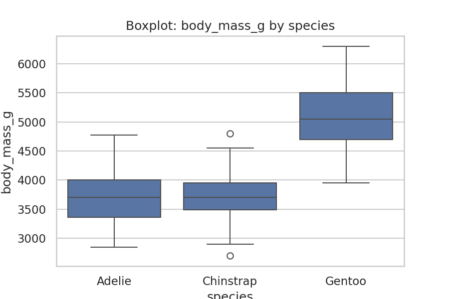

**인사이트:**

종별 체질량의 박스플롯은 중앙값, 분산 및 이상치 정보를 직관적으로 제공합니다. Gentoo는 중앙값과 IQR이 높아 전반적인 체격이 크고 개체 간 변동성도 큰 반면, Adelie와 Chinstrap는 더 낮은 중앙값과 상대적으로 좁은 분산을 가집니다. 이상치는 개체간 자연 변이 또는 측정·표본 오차를 반영할 수 있으므로 필요 시 개별 레코드 확인이 필요합니다. 통계적으로 유의한 차이가 확인되면 종별 생태적 역할(예: 포식자-먹이 관계, 번식 성공률)에 대한 해석이 가능합니다. 연구 설계 측면에서는 표본 크기와 불균형을 고려해 분석의 신뢰도를 확보해야 합니다。

::: notes
발표자 노트: 박스플롯을 보며 중앙값과 IQR을 통해 종 간 체질량 차이를 설명하세요. 이상치는 가능한 원인(측정 오류, 특이 개체)을 언급하고, 통계적 검정으로 차이를 확인할 것을 권고합니다.
:::

---

# 바이올린 플롯: bill_length_mm by species

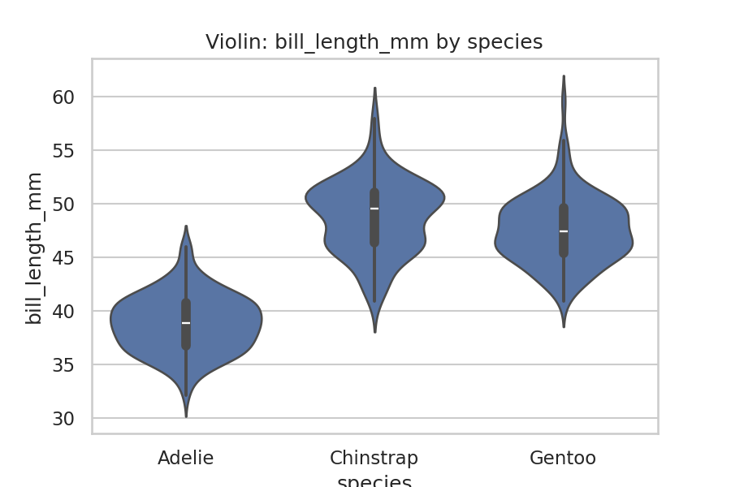

**인사이트:**

바이올린 플롯은 각 종 내 분포 밀도를 보여줘 다봉성, 편향성 등 분포 형태를 파악하는 데 유리합니다. 예를 들어 일부 종에서 부리 길이가 두 개 이상의 뚜렷한 피크를 보이면 하위 개체군(subpopulation)이 존재할 수 있습니다. 바이올린 내부의 박스(중앙값·IQR)를 통해 중앙 경향과 분산을 함께 해석하면 분포의 전반적 특성과 집단 간 차이를 종합적으로 이해할 수 있습니다. 이러한 분포 정보는 종 분류뿐 아니라, 생태적 적응(먹이원 차이, 번식기 별 조건)과 관련된 가설 수립에 유용합니다。

::: notes
발표자 노트: 바이올린 플롯에서 분포 모양과 다봉성을 강조하세요. 다봉성은 하위 집단의 존재를 시사하므로 추가로 섬·성별·연령 등으로 분할해 비교할 것을 권장합니다.
:::

---

# 산점도: bill_length_mm vs bill_depth_mm (species 색)

**인사이트:**

부리의 길이와 깊이 산점도는 두 변수의 결합적 정보를 통해 종 간 분포의 분리 정도를 보여줍니다. 종별 색상으로 표시하면 각 종이 어떻게 클러스터를 형성하는지 시각적으로 파악할 수 있고, 중첩이 적을수록 이 두 변수만으로도 분류 가능성이 높습니다. 데이터에서 관측되는 중첩은 추가 변수(플리퍼 길이, 체질량 등)의 도입으로 개선될 수 있으며, 이상치는 측정 오류나 특이 개체(예: 성장 이상)를 시사할 수 있으므로 후속 검증이 필요합니다. 다변량 분류 모델링 전 초기 탐색 단계에서 이 산점도는 변수 선택과 전처리 방향을 제시합니다.
::: notes
발표자 노트: 이 산점도는 두 변수의 결합적 차이를 보여주므로 클러스터 여부를 강조하세요. 중첩이 클 경우 추가 피처 도입을 권장하며, 이상치가 시각적으로 식별되면 개별 확인 계획을 언급하세요.
:::
---

# 산점도: bill vs depth (size=flipper_length_mm)

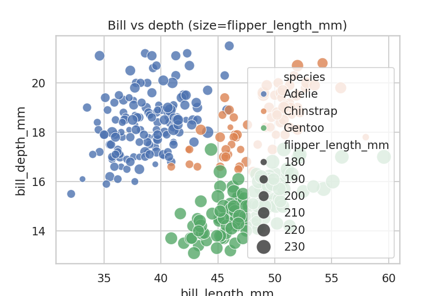

**인사이트:**

점의 크기로 플리퍼 길이를 표현하면 세 변수 간의 복합 관계를 동시에 관찰할 수 있습니다. 동일한 부리 치수 영역에서 플리퍼 길이가 큰 점들이 특정 종에 집중된다면 신체 크기와 부리 형태 간의 상호작용을 지지합니다. 이러한 시각화는 집단 간 체형의 통합성(integration)을 탐색하고, 동일한 형태 특징을 가진 개체들 내에서 추가적으로 체질량이나 번식 상태의 차이가 있는지를 판단하는 데 유용합니다. 데이터 기반으로 가설을 수립한 뒤 회귀모델이나 군집분석으로 검증하면 인과적 해석에 한걸음 더 다가갈 수 있습니다.
::: notes
발표자 노트: 점 크기(플리퍼 길이)를 통해 3변량 관계를 설명하세요. 특정 영역에서 점이 큰 경우 체형 통합성에 대한 가설을 제시하고, 이후 회귀/군집 분석으로 검증하겠다는 계획을 말해 주세요.
:::
---

# 회귀 산점도: bill_length vs bill_depth

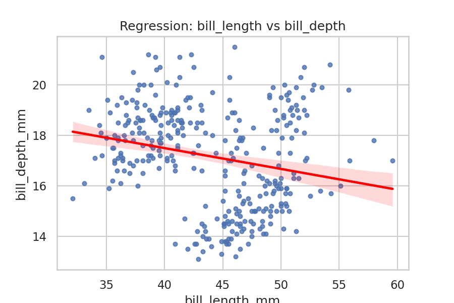

**인사이트:**

회귀선을 포함한 산점도는 두 변수 간의 선형 관계의 존재 여부와 강도를 시각적으로 평가하게 해줍니다. 만약 기울기가 뚜렷하고 잔차가 랜덤하게 분포한다면 선형 모델이 적절할 수 있으나, 잔차 구조에서 비선형성 또는 이분산성이 관찰되면 비선형 모델 혹은 변환(예: 로그 변환)을 고려해야 합니다. 이 관계는 종별로 다른 패턴을 보일 수 있으므로 종별 회귀분석을 수행하면 더 정밀한 해석이 가능합니다. 또한 회귀 분석 결과는 분류 또는 예측용 피쳐 엔지니어링에 활용될 수 있습니다。

::: notes
발표자 노트: 회귀선의 기울기와 잔차를 이용해 선형성 여부를 설명하세요. 비선형성이 의심되면 변환이나 비선형 모델을 제안하고, 종별 회귀로 패턴 차이를 확인할 계획을 소개합니다.
:::

---

# 조인트플롯: bill_length_mm vs body_mass_g

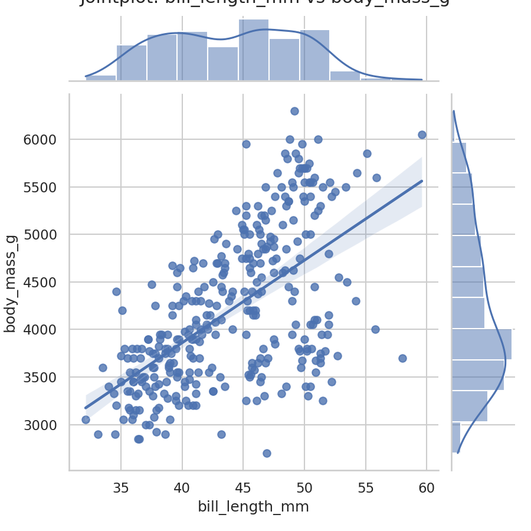

**인사이트:**

조인트플롯은 두 변수의 공동분포와 각각의 단변량 분포를 동시에 제공하여 상호 관계를 입체적으로 이해하게 합니다. 부리 길이와 체질량의 양의 상관은 신체 크기의 통합적 특성을 보여주며, 종별 색상을 통해 그룹별 차이를 동시에 평가할 수 있습니다. 히스토그램의 편향과 밀도 모양은 모집단 내 연령·성별·건강 상태와 같은 혼재 요인을 시사할 수 있으므로, 추가적으로 성별·섬별로 분할하여 분석하면 더 명확한 인사이트를 얻을 수 있습니다.
::: notes
발표자 노트: 조인트플롯은 공동분포와 단변량 분포를 동시에 보여줍니다. 두 변수의 양의 상관을 근거로 신체 크기 통합을 설명하고, 성별·섬별 분할분석으로 혼재요인을 확인하겠다고 말하세요.
:::
---

# 페어플롯: 주요 수치형 변수

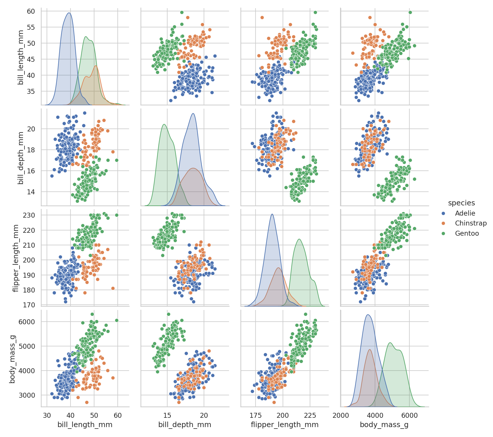

**인사이트:**

페어플롯은 여러 수치형 변수 쌍을 한 번에 보여줘 변수들 간의 상관 패턴과 클러스터링 구조를 직관적으로 파악하게 합니다. 플리퍼 길이와 체질량 간의 강한 양의 상관은 신체 크기의 통합적 특성을 반영하며, 반면 부리 길이/깊이와 체질량의 관계는 상대적으로 약해 서로 독립적인 정보를 제공할 수 있습니다. 페어플롯을 통해 변수 선택(중복 피처 제거 또는 상호보완 피처 선택)과 차원 축소(예: PCA) 적용 여부를 판단할 수 있고, 분류 모델에서 어떤 변수가 예측력 있는지를 선별하는 데 유용합니다.
::: notes
발표자 노트: 페어플롯을 통해 어떤 변수들에 주목해야 할지(예: flipper_length, body_mass)를 설명하세요. 차원 축소나 PCA 적용을 고려해 변수 수를 줄이고 모델의 해석성을 높일 계획을 언급합니다.
:::
---

# 상관 히트맵

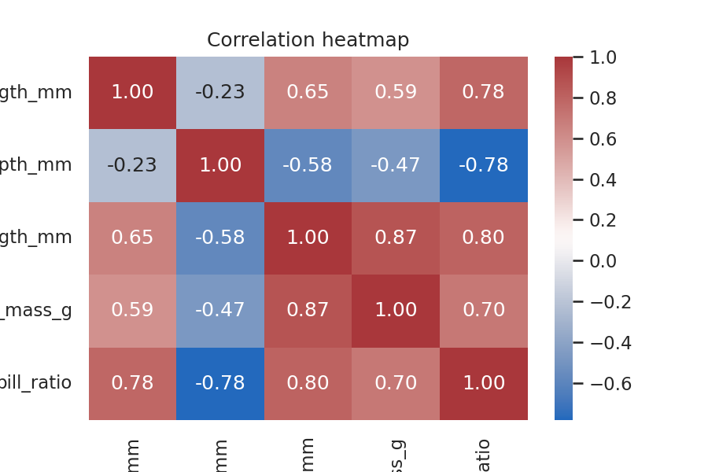

**인사이트:**

상관 히트맵은 수치형 변수 간의 선형 상관 강도를 한눈에 보여주어 다중공선성 여부와 피처 선택 문제를 판단하는 데 도움이 됩니다. 관찰된 결과에서 flipper_length와 body_mass는 높은 양의 상관을 보여 이 둘 중 하나는 모델 단축(피처 선택)시 대표로 선택될 수 있습니다. 반대로 부리 길이와 깊이는 중간 수준의 상관을 보여 서로 보완적인 정보를 제공할 가능성이 큽니다. 상관구조를 바탕으로 모델링 전 상관 기반 특성 공학(예: 상호작용 항 생성)이나 변수 변환을 고려하면 모델 성능 향상에 기여할 수 있습니다.
::: notes
발표자 노트: 히트맵을 근거로 flipper_length와 body_mass의 높은 상관을 설명하고, 다중공선성 문제로 하나를 선택하거나 피처 엔지니어링으로 해결할 수 있음을 예시로 제시하세요.
:::
---

# 카운트플롯: species

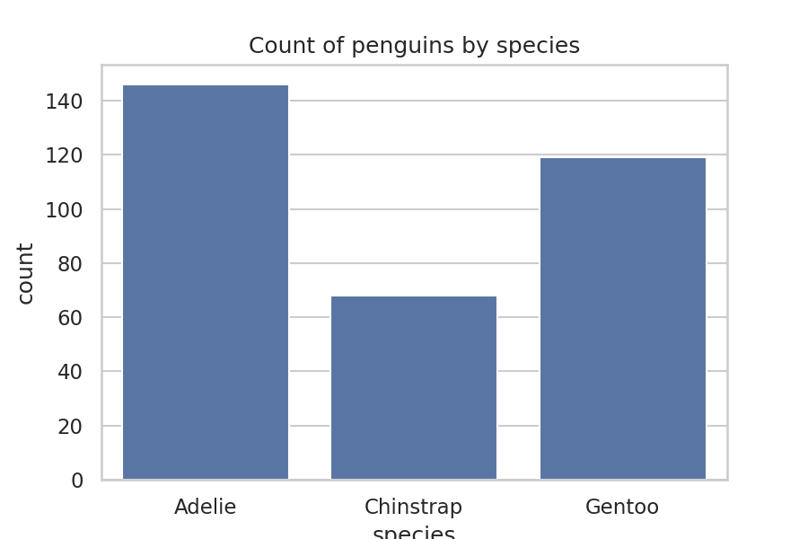

**인사이트:**

종별 표본 수 분포는 데이터셋의 표본 구성과 해석의 신뢰성에 직접적인 영향을 줍니다. 본 데이터에서는 Adelie 표본이 가장 많고 Chinstrap가 가장 적어 표본 불균형이 존재합니다. 이 불균형은 통계 검정이나 분류 모델 학습 시 편향을 초래할 수 있으며, 필요시 가중치 보정, 재샘플링(오버/언더샘플링) 등을 적용해 모델의 공정성을 확보해야 합니다. 또한 표본 수 차이는 종별 추정치의 신뢰구간 크기에도 영향을 미치므로 해석 시 주의가 필요합니다.
::: notes
발표자 노트: 표본 불균형을 시청자에게 알리고, 불균형이 분석 결과에 미치는 영향(편향·신뢰구간)을 설명하세요. 모델링 시 적용할 수 있는 방법(가중치, 재샘플링)을 간단히 소개합니다.
:::
---

# 그룹 막대: sex by species

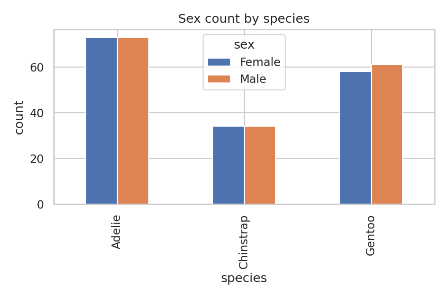

**인사이트:**

성별과 종의 교차표는 성비가 종마다 어떻게 다른지를 보여 주며, 특정 종에서 한 성별이 우세한 경우 번식 생태나 표본 수집 방법의 편향을 의심해볼 수 있습니다. 교차표를 절대값뿐 아니라 비율로도 확인하면 성비 불균형의 영향력을 더 명확히 판단할 수 있습니다. 또한 성별에 따른 체질량·플리퍼 길이 등의 차이를 종합적으로 분석하면 성적 이형성의 존재와 그 생태적 의의를 규명할 수 있습니다.
::: notes
발표자 노트: 성별 분포를 설명하면서, 특정 종의 성비 우세가 실제 생태적 차이인지 표본 편향인지 따져볼 필요가 있다는 점을 강조하세요. 비율과 절대값을 함께 보면 더 명확합니다.
:::
---

# 스택형 막대: island by species (정규화)

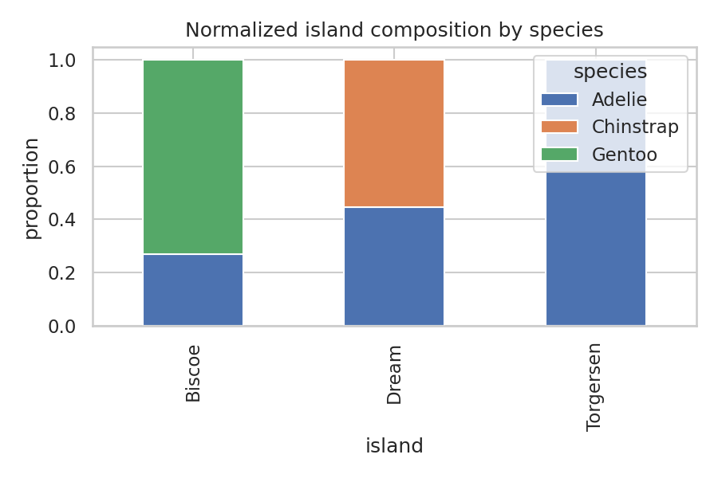

**인사이트:**

섬별 종 구성의 분포를 정규화해 비교하면 지역별 서식지 특성이나 자원 분포가 종 분포에 미치는 영향을 가늠할 수 있습니다. 특정 섬에서 한 종이 압도적으로 우세한 경우 그 섬의 서식 조건이 해당 종에 유리함을 시사할 수 있으며, 이는 보전 우선순위 결정이나 현장 조사의 목표 설정에 중요한 정보를 제공합니다. 지역적 차이를 설명하기 위해서는 추가적 환경 변수(예: 먹이 자원, 해수 온도, 포식자 유무)를 고려한 다변량 분석이 필요합니다.
::: notes
발표자 노트: 섬별 구성 차이가 보전 우선순위에 어떤 의미를 갖는지 설명하세요. 특정 섬에만 서식하는 종이 있다면 현장 조사 우선순위를 제안한다고 말하면 좋습니다.
:::
---

# 교차표: species × island

| species   |   Biscoe |   Dream |   Torgersen |
|:----------|---------:|--------:|------------:|
| Adelie    |       44 |      55 |          47 |
| Chinstrap |        0 |      68 |           0 |
| Gentoo    |      119 |       0 |           0 |

::: notes
발표자 노트: 표를 직접 보여주면서 Biscoe에는 Adelie가, Dream에는 Chinstrap과 Adelie가, Torgersen에는 Adelie가 포함되는 구조임을 설명하세요. 절대값에 따라 표본 불균형을 고려해 비율로도 비교할 필요가 있음을 언급하고, 필요 시 Chi-square 검정을 통해 유의성 확인을 제안합니다.
:::

---

# 피봇테이블: mean body_mass_g (island × species)

| island    |   Adelie |   Chinstrap |   Gentoo |
|:----------|---------:|------------:|---------:|
| Biscoe    |   3709.7 |       nan   |   5092.4 |
| Dream     |   3701.4 |      3733.1 |    nan   |
| Torgersen |   3708.5 |       nan   |    nan   |

::: notes
발표자 노트: 피봇테이블을 통해 섬별·종별 평균 체질량을 비교하세요. Gentoo는 Biscoe에서 평균 체질량이 높게 나타나며, 같은 종이라도 섬 간 차이가 존재할 수 있음을 강조하고, 표준오차/표준편차 추가로 통계적 검증을 권장합니다.
:::

---

# 결론 및 다음 단계

- 부리 형태(bill_length, bill_depth, bill_ratio)와 체격(flipper_length, body_mass)은 종 구분에 유용한 형질임이 확인됨
- 섬별 분포 차이는 지역적 생태 요인의 영향을 시사하므로 추가 환경 데이터를 결합한 분석 권장
- 표본 불균형을 고려한 통계적 보정/재샘플링 및 종별·성별 분할 분석을 통해 인과적 해석 개선 필요

::: notes
발표자 노트: 결론을 간결히 요약하고, 다음 단계로 환경 데이터 결합, 통계적 검증(ANOVA, Chi-square), 재샘플링 및 종별·성별 추가 분석을 제안하세요. 실무 적용(보전 정책 제안) 가능성을 언급하면 좋습니다.
:::

---

# 참고: 원본 데이터 및 코드

- 노트북: `penguins_analysis.ipynb`
- 원본 CSV: `penguins.csv`
- 이미지: `figures/` 디렉터리
- 표: `tables/` 디렉터리

::: notes
발표자 노트: 코드와 데이터를 재현하는 방법을 안내하세요(penguins_analysis.ipynb 실행 방법). 추가 자료 요청 시 깃허브 저장소 링크를 제공하고, 추후 분석 재현 가능성을 강조합니다.
:::

---

